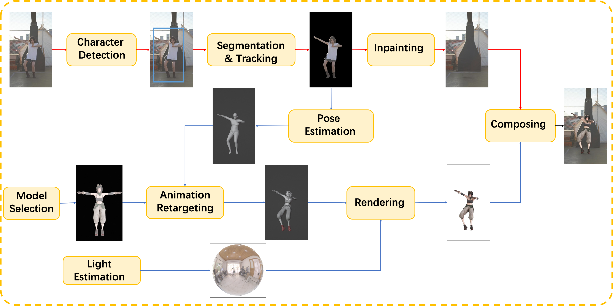

# MotionShop
An application of replacing the characters in video with 3D avatars.

 

  

## 📜 News

$\color{red}{\textsf{🔥New }}$
[2024/01/18] The experience demo of MotionShop is now available on <a href = 'https://modelscope.cn/studios/Damo_XR_Lab/motionshop/summary' >ModelScope</a>.

We are working hard to bring our live demo to 🤗<a href = 'https://huggingface.co/spaces/modelscope/Motionshop'>HuggingFace</a>🤗, thanks for your patience.

## 📌 Notes

$\color{red}{\textsf{Please give us a ⭐star⭐ if you like this project. Thanks!!!}}$ 😁😁😁

We will keep optimizing our project, any updates will be posted here.

Feel free to enjoy MotionShop and share your interesting results with us. If you have any questions or suggestions, don't hesitate to leave a message in the issues section.